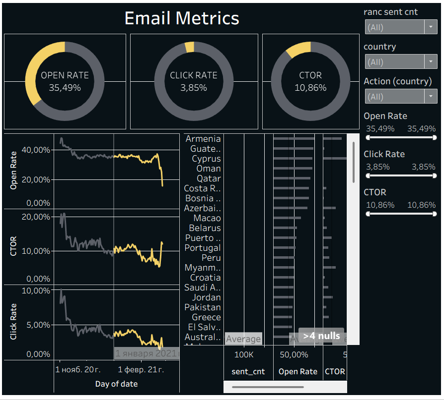

# Email Marketing Analysis

Analysis of email marketing performance of an online store: how many accounts are created, how users react to emails, and which countries are the most important for email marketing.

**Tools:** SQL (Google BigQuery) · Tableau

**Interactive dashboard:** [Tableau Public](https://public.tableau.com/views/EmailMetrics2_17847595227210/EmailMetrcs)

## Approach
1. **Account metrics:** number of created accounts by date, country, send interval, verification and subscription status.
2. **Email metrics:** sent, opened and visited emails for the same dimensions.
3. **Combined dataset:** both parts joined with `UNION ALL` and aggregated.
4. **Window functions:** total accounts and sent emails per country (`SUM() OVER`), country ranks (`DENSE_RANK()`), filter to the top-10 countries.
5. **Dashboard** in Tableau: open rate, click rate and CTOR over time and by country.

## SQL techniques used
CTEs (`WITH`) · `UNION ALL` · `LEFT JOIN` · aggregation with `COUNT(DISTINCT)` · window functions `SUM() OVER (PARTITION BY)` and `DENSE_RANK()` · date arithmetic with `DATE_ADD`

## Key metrics
| Metric | Formula | Value |
|---|---|---|
| Open Rate | opened / sent | 35.5% |
| Click Rate | visited / sent | 3.9% |
| CTOR | visited / opened | 10.9% |

## Key findings
- About **every third email is opened**, but only about **1 in 10 opened emails leads to a website visit**.
- Engagement was highest in the **first days of November** (open rate above 40%, CTOR around 20%), then dropped and stayed stable at about 35% open rate and 10% CTOR.
- The sharp drop at the very end of the period is most likely caused by **incomplete recent data**, not by a real change in behaviour.
- Countries with the highest open rate are mostly **small markets with few emails**, so their rates should be read with caution.

## Files
| File | Content |
|---|---|
| `email_metrics.sql` | SQL query that builds the dataset for the dashboard |
| `dashboard.png` | screenshot of the Tableau dashboard |

## Limitations
Short period (Nov 2020 – Feb 2021), no information about email content or campaigns, small countries have too few emails for reliable rates.
